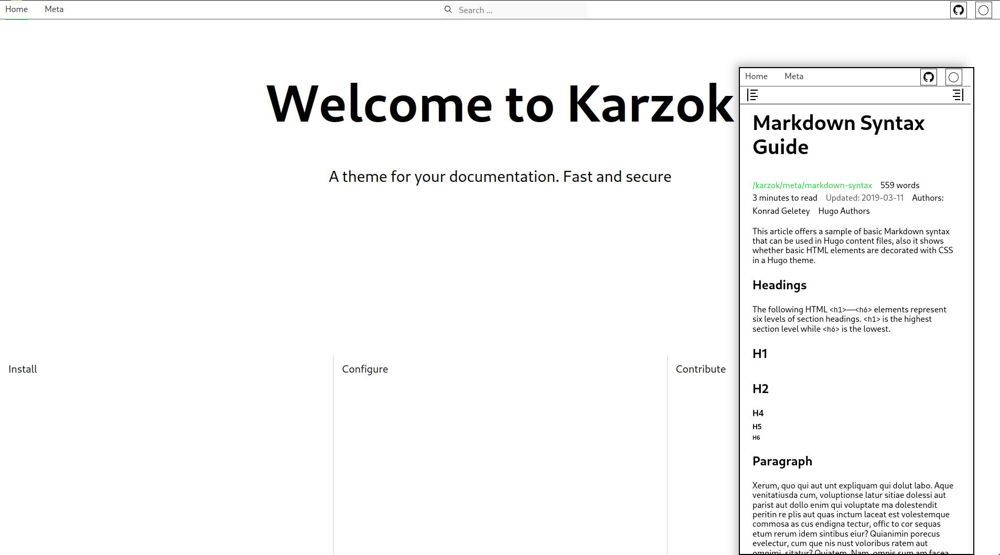

<p align="center">
  <a href="https://github.com/kogeletey/karzok/actions"></a>
<!--  <a href="https://github.com/kogeletey/karzok/actions"></a> -->
  <a href="https://github.com/kogeletey/karzok/blob/develop/LICENSE"></a>
  <a href="https://github.com/kogeletey/karzok/releases"></a>
  <a href="https://framagit.org/kogeletey/fmatch.org"></a>
</p>

# Karzok

A theme for your documentation. Fast and secure



## Demo

[Fmatch Karzok](https://fmatch.org/karzok)

## Requirements

Karzok uses npm,zola to dependency managment,rendering, scripts and plugins.

### Install

1. [Zola](https://www.getzola.org/documentation/getting-started/installation/)
2. [Node.js](https://nodejs.org/)
3. [rsync](https://rsync.samba.org)

for your platform.

### Optional

- [docker](https://docs.docker.com/engine/install/)
   > for packaging container

## Get Started

### 1. Create a new zola site

```zsh
zola init zola_site
```

### 2. Download this theme to you themes directory:

```zsh
git clone https://git.sr.ht/~kogeletey/karzok zola_site/themes
```

or install as submodule:

```zsh
cd zola_site
git init # if your project is a git repository already, ignore this command
git submodule add https://git.sr.ht/~kogeletey/karzok zola_site/themes
```

### 3. Configuration. Open in favorite editor `config.toml`

```toml
base_url = "https://karzok.example.net" # set-up for production
theme = "karzok"
```

See more in [configuration](https://fmatch.org/karzok/configure/)

### 4. Added new content

```zsh
    cp ./themes/content/_index.md content/_index.md
    # a template will appear with which you can quickly start writing
    # cp ./themes/content/tmpl.md content/filename.md
```

how you can give freedom to your creativity

### 5. Run the project

i. development enviroment

1. Install node dependencies needed to work

```zsh
npm ci
npm run gen 
```

2. Just run `zola serve` in the root path of the project

```zsh
zola serve
```

Open in favorite browser [http://127.0.0.1:1111](http://127.0.0.1:1111). Saved
changes live reolad.

ii. production enviroment

- with docker

1. Build docker image

```zsh
docker build .
```

or if installed docker compose

```zsh
docker compose build
```

2. Run containers

```zsh
docker start -d -p 80:80 container_id
```

or if installed docker compose

```zsh
docker-compose up -d
```

Open in favorite browser [https://localhost](http://localhost)

## Configuration

## options under the `[extra]`

1. `math` - rendering math formulas throught [katex](https://katex.org)
2. `favicon` - set path to favicon icon import(default `favicon`)
3. `localcdn`- if you want to store all assets on your domain, then enable this
   setting
4. `cdnurl` - you can customize your url to store assets,default use
   [jsdelivr](https://www.jsdelivr.com)
5. `show_word_count` - allowing you to show number of words
6. `show_reading_time`- allowing you to show reading time
7. `[[extra.menu]]` - the main navigation on the site
8. `[[extra.header_right]]`,`[[extra.header_left]]` - the header navigantion for the site
9. `theme_color` which allow tab coloring in safari
10. `relative_path` which prints in full url on the page

### Templates

All pages are extend to the base.html, and you can customize them as need.

## License

This program is Free Software: You can use, study share and improve it at your
will. Specifically you can redistribute and/or modify it under the terms of the
[MIT](https://mit-license.org/)

# Contribute

Make sure to read the [Code of Conduct](/meta/code-of-conduct)

## Find bugs and come up with features

On the [todo.sr.ht](https://todo.sr.ht/~kogeletey/karzok) or
[github issues](https://github.com/kogeletey/karzok/issues)

## Improve Code

The Karzok is stored in the repository at
[sr.ht](https://sr.ht/~kogeletey/karzok) and mirror
[github](https://github.com/kogeletey/karzok)

> Thank you so much for any help
